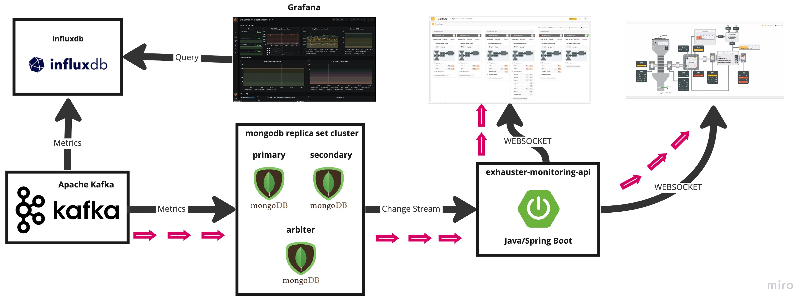

# Хакатон ЕВРАЗа 2.0

## Дашборд мониторинга состояния эксгаустеров

### Контекст задачи

Разработать веб-приложение, с помощью которого машинист эксгаустера сможет мониторить состояние эксгаустеров и прогнозировать их возможную поломку.

Основа работы сервиса - поток реальных данных с датчиков агрегата

### Формулировка подзадач

Задачу можно разбить на три основные подзадачи:

- Разработка сервиса для приема и сохранения потока данных с эксгаустера и предоставления интерфейса доступа к этим данным.
- Разработка веб-интерфейса для рабочего места машиниста эксгаустера. Интерфейс должен позволять как минимум:
    - Отображать текущее состояние всех эксгаустеров на одном экране
    - Визуализировать детальные данные по конкретному эксгаустеру
    - Визуализировать поток данных во времени для анализа трендов
- Разработка алгоритма определения даты замены ротора эксгаустера и отображение результатов его работы в веб-интерфейсе.

### Архитектура решения



### Описание REST API

После запуска бэкэнд-сервиса локально или в контейнере спецификация OpenAPI доступна по ссылке: [http://localhost:8080/swagger-ui/index.html](http://localhost:8080/swagger-ui/index.html)

Так же есть http-файл для тестирования ```api-test.http```


### Описание WebSocket API
После запуска бэкэнд-сервиса локально или в контейнере доступен канал вебсокета для метрик эксгаустеров

```http request
WEBSOCKET ws://localhost:8080/info
Content-Type: application-json
```